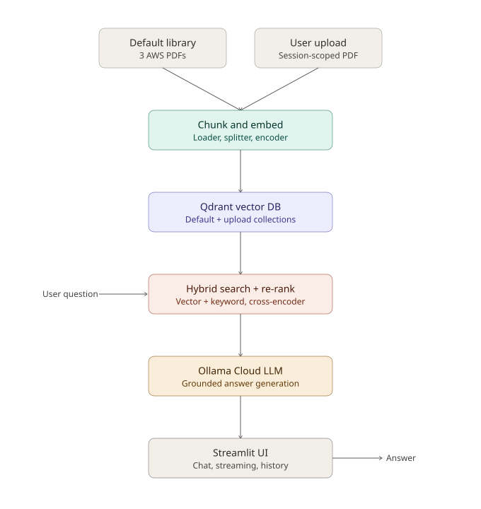

# AWS Research Assistant
 
A retrieval-augmented generation (RAG) system for querying AWS documentation, built with hybrid search, cross-encoder re-ranking, a cloud-hosted LLM, and a production-style feature set: multi-user chat persistence, conversation memory, session-scoped document uploads, and an automated evaluation suite.
 
**Live demo:** https://rag-research-assistant-xouyr8vyrgb6w9e46ncikx.streamlit.app/
**Repository:** https://github.com/mubiii3456/rag-research-assistant
 
---
 
## Table of contents
 
- [Overview](#overview)
- [Architecture](#architecture)
- [Features](#features)
- [Tech stack](#tech-stack)
- [Evaluation](#evaluation)
- [Project structure](#project-structure)
- [Setup](#setup)
- [Engineering notes](#engineering-notes)
- [Known limitations](#known-limitations)
---
 
## Overview
 
The system answers questions about AWS services, security, and architecture using three source PDFs (AWS Overview, AWS Security, AWS Well-Architected Framework) as a default knowledge base, plus support for a user-uploaded PDF scoped to their session. Every answer is grounded in retrieved source text, cites the page it came from, and explicitly declines to answer when the documents don't contain the information — verified against adversarial test questions in the evaluation suite.
 
Beyond basic retrieval, the system implements a two-stage retrieval pipeline (hybrid search + re-ranking), persistent multi-user chat history, follow-up-question handling, and streaming responses — the kind of detail required to move a RAG demo toward something closer to a real product.
 
---
 
## Architecture
 

 
**Ingestion.** PDFs — either the fixed default library or a document uploaded by a user — are loaded page by page, split into overlapping chunks (800 characters, 150 overlap) to preserve context across boundaries, embedded with a sentence-transformer model, and written to Qdrant in batches. Default documents and user uploads are kept in separate collections; uploads are tagged with a session ID for isolation and are deleted automatically after 24 hours.
 
**Retrieval.** A query is expanded with the last two user turns (to resolve follow-ups like "how much does it cost?"), then run through two retrieval methods in parallel: dense vector similarity search in Qdrant, and BM25 keyword search over a locally cached index. The two result sets are merged with weighted scoring (60% vector, 40% keyword), and the top candidates are passed through a cross-encoder re-ranker to produce the final, precision-ordered context.
 
**Generation.** The re-ranked chunks, the current question, and the last three turns of conversation history are sent to an LLM (Ollama Cloud) with a system prompt that restricts answers to the provided context. The response streams back to the UI token by token.
 
**Interface.** A Streamlit frontend provides a chat interface with a document-source toggle (default library / user upload / both), a file uploader with validation, a ChatGPT-style sidebar for switching between saved conversations, and source citations displayed alongside every answer.
 
---
 
## Features
 
**Retrieval quality**
- Hybrid search combining dense vector similarity and BM25 keyword matching
- Cross-encoder re-ranking of retrieved candidates for higher precision
- Query expansion from recent conversation turns to resolve follow-up questions
**Grounding and reliability**
- Answers are restricted to retrieved context via system prompt; the model is instructed to state when information isn't available rather than infer
- Page-level source citations returned with every answer
- Error handling around retrieval and generation failures, with user-facing fallback messages instead of crashes
**Document handling**
- A curated default document library, always available
- Per-session PDF uploads, isolated by session ID, with file size and corruption validation
- A scheduled cleanup job removes uploads older than 24 hours
- Search scope toggle: default library, user upload, or both combined
**Conversation and persistence**
- Multi-turn conversation memory passed to the LLM for natural follow-ups
- SQLite-backed chat history that survives page refreshes
- Multi-user isolation via a browser-persisted identifier, so one user's conversations are never visible to another
- A sidebar for starting new conversations and switching between saved ones, modeled on a standard chat-app UX
**Operational safeguards**
- Per-session rate limiting (30 questions per session)
- Batched vector uploads with retry logic, to handle large documents without network timeouts
- A locally cached keyword index, avoiding repeated full-collection reads from the vector database on every query
**Delivery**
- Streaming responses rendered progressively rather than all at once
- Deployed on Streamlit Community Cloud with keep-alive monitoring to prevent idle shutdown
- A 15-question automated evaluation suite with recorded results
---
 
## Tech stack
 
| Layer | Technology | Notes |
|---|---|---|
| Document parsing | pypdf | Page-level text extraction |
| Chunking | Custom splitter | Fixed-size with overlap, metadata-tagged per chunk |
| Embeddings | sentence-transformers (`all-MiniLM-L6-v2`) | 384-dimension vectors |
| Vector database | Qdrant Cloud | Two collections: default documents, session uploads |
| Keyword search | rank-bm25 | Cached locally, rebuilt on demand |
| Re-ranking | cross-encoder (`ms-marco-MiniLM-L-6-v2`) | Applied to top hybrid-search candidates |
| LLM | Ollama Cloud (`minimax-m3:cloud`) | Accessed via direct HTTP API (not the local daemon), required for cloud deployment |
| Frontend | Streamlit | Custom CSS theme, chat interface |
| Persistence | SQLite | Chat history, keyed by session and user identifier |
| Deployment | Streamlit Community Cloud | Environment secrets for Qdrant and Ollama credentials |
 
---
 
## Evaluation
 
A 15-question suite spans easy, medium, and hard questions across all three source documents, plus two adversarial questions with no answer in the source material — included specifically to check that the system declines rather than hallucinates.
 
| Metric | Result |
|---|---|
| Questions answered correctly | 15 / 15 |
| Adversarial questions correctly declined | 2 / 2 |
| Average response time | ~11s |
 
Full question-by-question results, including retrieved sources, response times, and manual verdicts, are in [`evaluation/eval_results.md`](evaluation/eval_results.md). The evaluation script (`evaluation/run_eval.py`) can be re-run against the live system at any time.
 
---
 
## Project structure
 
```
rag-research-assistant/
├── app/
│   ├── ingestion/          # PDF loading, chunking, embedding, batch upload, upload handling
│   ├── retrieval/          # Qdrant client setup, hybrid search, re-ranking, BM25 cache
│   └── generation/         # LLM prompting, context building, streaming
├── frontend/
│   ├── streamlit_app.py    # Chat UI, sidebar, session/user management, guardrails
│   └── chat_db.py          # SQLite persistence layer
├── evaluation/
│   ├── eval_questions.json
│   ├── run_eval.py
│   └── eval_results.md
├── langchain_comparison/   # Equivalent pipeline built with LangChain, for reference
├── scripts/                # Maintenance utilities (collection reset)
├── experiments/            # Early local retrieval validation script (pre-Qdrant)
├── docs/
│   └── architecture.svg
└── requirements.txt
```
 
---
 
## Setup
 
**1. Clone and install**
 
```bash
git clone https://github.com/mubiii3456/rag-research-assistant.git
cd rag-research-assistant
python -m venv venv
venv\Scripts\Activate.ps1        # Windows
pip install -r requirements.txt
```
 
**2. Configure credentials**
 
Create a `.env` file in the project root:
 
```
QDRANT_URL=your_qdrant_cluster_url
QDRANT_API_KEY=your_qdrant_api_key
OLLAMA_API_KEY=your_ollama_cloud_api_key
```
 
**3. Initialize the vector database**
 
```bash
python app/retrieval/qdrant_client_setup.py
```
 
**4. Load documents and build the keyword index**
 
```bash
python app/ingestion/upload_to_qdrant.py path/to/your.pdf
python app/ingestion/build_bm25_cache.py
```
 
**5. Run**
 
```bash
streamlit run frontend/streamlit_app.py
```
 
---
 
## Tech Decisions
 
**Hybrid search over pure vector search.** Early testing with pure vector search occasionally ranked a table-of-contents chunk above the chunk containing the actual answer for exact-term queries. Adding BM25 keyword matching alongside vector search, followed by cross-encoder re-ranking, corrected the ordering.
 
**A locally cached keyword index instead of live Qdrant scrolling.** Building the BM25 index from a live Qdrant scroll on every query caused network timeouts once the default collection passed a few hundred chunks. The index is now built once via a dedicated script and cached locally, since the default document set is static at runtime.
 
**Batched uploads with retry logic.** Uploading a 600+ chunk document in a single request to Qdrant caused write timeouts. Uploads are now sent in batches of 20 with automatic retry on failure.
 
**Session-scoped, not shared, user uploads.** Uploaded documents are tagged with a session ID and filtered at query time, so one visitor's upload is never retrievable by another. A scheduled cleanup script removes uploads older than 24 hours; a payload index on `session_id` and `uploaded_at` makes the filtering queries efficient.
 
**Direct Ollama Cloud API instead of the local daemon.** Locally, Ollama Cloud models are accessed through a signed-in local daemon. That daemon isn't present in the deployment environment, which caused connection failures after deploying. The fix was to call Ollama Cloud's HTTP API directly with an API key, removing the dependency on local infrastructure.
 
**A custom-built pipeline, with a LangChain reference implementation for comparison.** The retrieval and generation pipeline in `app/` was built from its component parts — PDF loading, chunking, embedding generation, hybrid search, re-ranking, and prompt construction were each implemented directly, rather than through a framework's abstractions. This was a deliberate choice to work through the trade-offs at each stage of a RAG system rather than delegate them.
 
[`langchain_comparison/langchain_version.py`](langchain_comparison/langchain_version.py) implements the same PDF-to-answer flow using LangChain's `PyPDFLoader`, `RecursiveCharacterTextSplitter`, `HuggingFaceEmbeddings`, `Qdrant`, and `RetrievalQA` — in roughly 40 lines versus 500+ in the custom pipeline. It does not include hybrid search or re-ranking, since `RetrievalQA` only exposes plain vector retrieval; matching that behavior would require the same custom work this project already does. It exists as a reference to show the two approaches side by side, not as part of the deployed application.
 
A full trade-off comparison is in [`langchain_comparison/README.md`](langchain_comparison/README.md).
 
---
 
## Known limitations
 
- User isolation relies on a browser-persisted identifier rather than authentication; adequate for a demo, not for handling sensitive or private data
- Free-tier LLM and vector database services impose rate and resource limits; heavy concurrent use may degrade response times
- Streaming granularity depends on the LLM provider's implementation and may arrive in sentence- or paragraph-sized chunks rather than token by token
- The free-tier Qdrant cluster suspends after extended inactivity and requires manual reactivation
---
 
## License
 
MIT
 